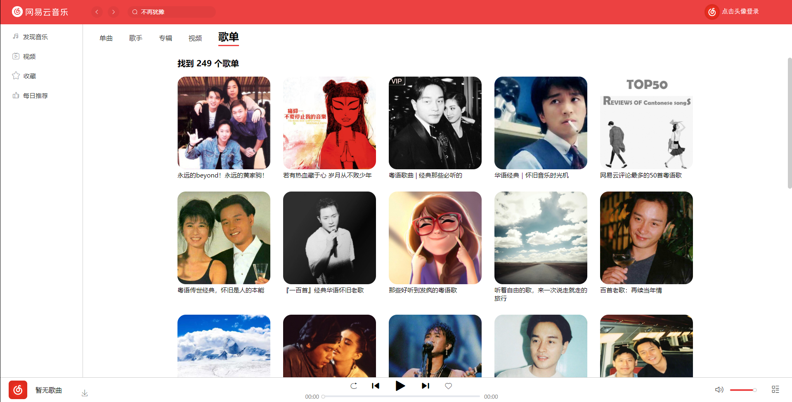

# vue3-cloudmusic

### 前言

首先还是得感谢 [网易云音乐 NodeJS 版 API](https://binaryify.github.io/NeteaseCloudMusicApi/#/) 提供的 API 练手，给予了学习的机会，还有 [前辈](https://gitee.com/PengGeee/vue_cloud_music) 已经功能完成部署上线的网站样式作为参考学习。

现在已经完成的大部分的功能，不过还是有地方做的不好，欢迎各位大佬留言提出建议。

### 项目简介：

本项目是一款基于网易云 API 而开发的仿网易云音乐客户端的 PC 端网页版音乐播放器。

### 项目安装

```
//首先应该克隆安装当前项目
git clone https://gitee.com/wenqian-li/vue3-cloudmusic.git

//然后安装项目依赖
npm install

//之后部署服务端项目
克隆服务端项目到本地，npm install 安装依赖，node app.js运行项目
服务端项目地址：https://github.com/Binaryify/NeteaseCloudMusicApi

//最后运行项目即可
npm run serve
```

### 技术栈：

本项目使用到的技术栈有：Vue3，Vue-Router，Vuex、Axios，使用 Element-Plus 作为第三方 UI 组件库，页面的样式布局整体采用的是 flex 弹性布局，使用 less CSS 预编译器用作 CSS 编码。

### 线上预览地址：

http://47.113.217.152

暂时部署在线上了，阿里云白嫖了四个月

### 视频预览

[视频预览地址](https://www.bilibili.com/video/BV1QU4y1i78e?spm_id_from=333.999.0.0&vd_source=77368900d492a842ee1831a47f983944)

视频预览效果就懒得更新了，大致差不多，就是添加了功能

### 效果图：

##### 首页（发现音乐）：


##### 视频：


##### 视频-mv：


##### 收藏-专辑：


##### 收藏-歌手：


##### 收藏-视频：


##### 每日推荐：


##### 歌单推荐：


##### 排行榜:


##### 歌手：


##### 搜索单曲：


##### 搜索歌手：


##### 搜索专辑：


##### 搜索视频：


##### 搜索歌单：



##### 歌手详细页：


##### 歌单详细页：


##### 视频详细页：


##### 专辑详细页：


##### 用户详细页：


##### 左下角进入歌曲详细页：


##### 歌手详细页（毛玻璃效果）：


##### 播放列表：


### 项目页面功能完成列表

✅ 首页（发现音乐）

✅ 歌单

✅ 排行榜

✅ 歌手

✅ 搜索

✅ 歌手、歌单、专辑、视频、用户主页详细页面

✅ 歌曲详细（歌词、评论）

✅ 登录（扫码和手机验证码登录）、注册、退出

✅ 视频页面（左边导航栏大模块）

✅ 收藏（左边导航栏大模块）

✅ 每日推荐（左边导航栏大模块）

✅ 歌曲、歌单、专辑，视频的评论以及对评论进行点赞

✅ 歌曲播放时歌词自动定位
